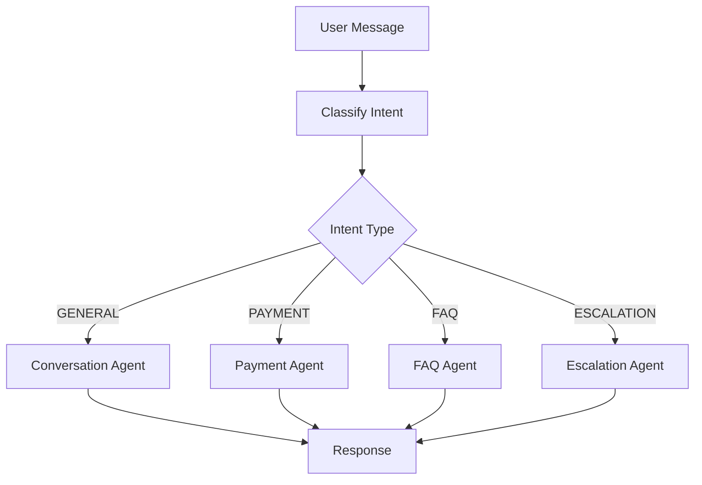
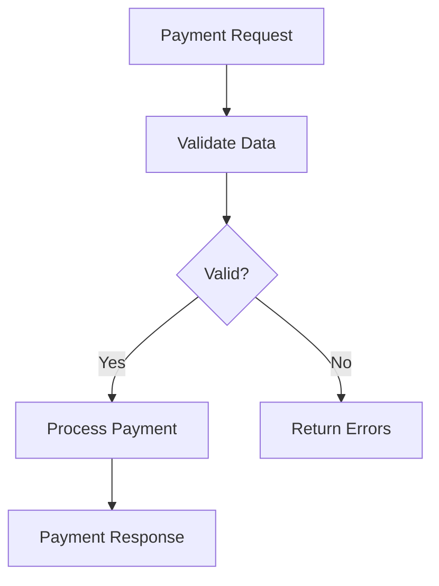

# Architecture Documentation

## System Overview

The LangGraph Chatbot is a multi-agent system designed for intelligent conversation handling with specialized capabilities for payment processing, FAQ responses, and escalation management.

## Core Components

### 1. Agent Layer

#### ConversationAgent
- **Purpose**: General conversation and chat orchestration
- **Responsibilities**:
  - Handle general queries
  - Maintain conversation context
  - Provide friendly responses

#### IntentClassifierAgent
- **Purpose**: Classify user intent
- **Responsibilities**:
  - Analyze user messages
  - Determine intent type (PAYMENT, FAQ, GENERAL, ESCALATION)
  - Provide confidence scores

#### PaymentAgent
- **Purpose**: Process payment requests
- **Responsibilities**:
  - Validate payment data
  - Process transactions
  - Generate payment confirmations

#### FAQAgent
- **Purpose**: Answer frequently asked questions
- **Responsibilities**:
  - Provide accurate answers
  - Handle common queries
  - Suggest escalation when needed

#### EscalationAgent
- **Purpose**: Handle complex cases
- **Responsibilities**:
  - Acknowledge complex issues
  - Collect information for human support
  - Set expectations

### 2. Workflow Layer

#### Chat Workflow

#### Payment Workflow

### 3. State Management

#### ChatState
- **messages**: Conversation history
- **intent**: Detected user intent
- **intent_confidence**: Confidence score
- **context**: Additional context data
- **payment_data**: Payment information
- **session_id**: Session identifier
- **final_response**: Generated response

#### PaymentState
- **transaction_id**: Unique transaction ID
- **amount**: Payment amount
- **currency**: Currency code
- **status**: Payment status
- **validation_errors**: Validation errors

### 4. LLM Integration

#### LM Studio Service
- OpenAI-compatible API client
- Configurable base URL and model
- Retry logic and error handling
- Connection testing

### 5. Memory System

#### ConversationMemory
- Sliding window for message history
- Configurable max history length
- Message trimming and summarization

#### SessionMemoryManager
- Multi-session support
- Session-based memory isolation
- Session cleanup

### 6. API Layer

#### FastAPI Application
- RESTful endpoints
- Swagger documentation
- CORS support
- Health checks

## Data Flow

1. **User Request** → API endpoint receives message
2. **State Creation** → Initial state with user message
3. **Intent Classification** → IntentClassifierAgent analyzes intent
4. **Routing** → Conditional routing based on intent
5. **Agent Processing** → Specialized agent handles request
6. **Response Generation** → LLM generates natural language response
7. **State Update** → Final state with response
8. **API Response** → Return response to user

## Design Patterns

### 1. Agent Pattern
- Base agent class with common functionality
- Specialized agents inherit from base
- Consistent interface across agents

### 2. Workflow Pattern
- State-based execution
- Conditional routing
- Node-based processing

### 3. Service Pattern
- Dependency injection
- Service layer abstraction
- Testable components

## Scalability Considerations

- **Horizontal Scaling**: Stateless API design allows multiple instances
- **Caching**: Session memory can be moved to Redis
- **Async Processing**: All agents use async/await
- **Checkpointing**: State persistence for long-running conversations

## Security Considerations

- **Input Validation**: All inputs validated before processing
- **Payment Security**: Mock mode for development, real gateway for production
- **API Security**: CORS configuration, rate limiting (to be added)
- **Data Privacy**: Local LLM processing for sensitive data

## Performance Optimization

- **LLM Caching**: Reuse LLM instances
- **Memory Management**: Sliding window for conversation history
- **Async Operations**: Non-blocking I/O throughout
- **Connection Pooling**: Reuse HTTP connections

## Monitoring and Logging

- **Structured Logging**: Consistent log format
- **Log Levels**: DEBUG, INFO, WARNING, ERROR
- **File and Console**: Dual output for logs
- **Request Tracking**: Session IDs for tracing
