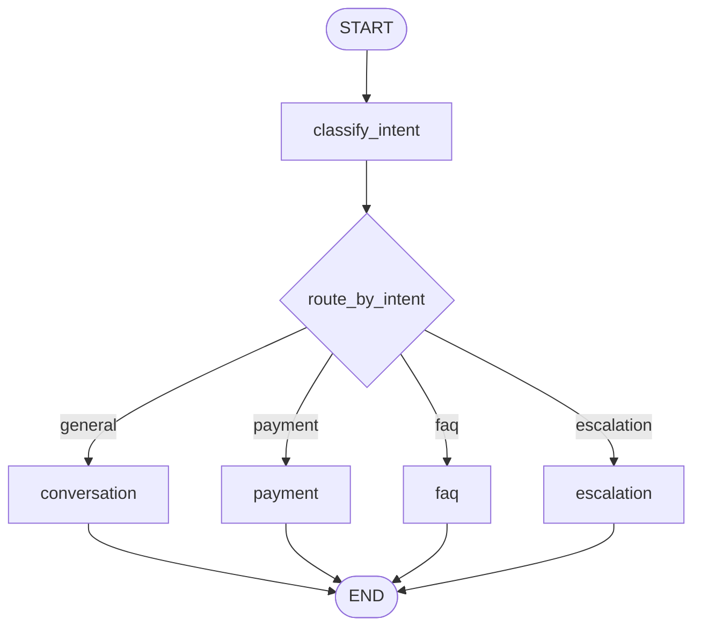
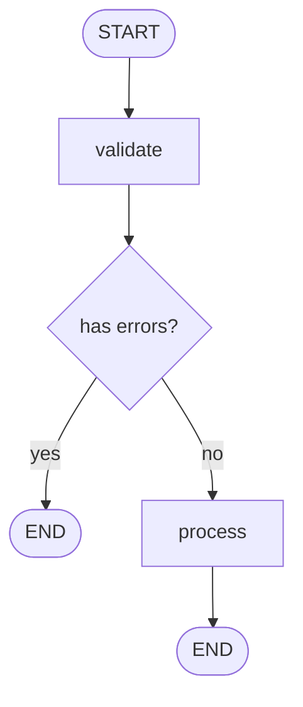

# LangGraph Graphs Module - Giải Thích Chi Tiết

## 📁 Tổng Quan Module `src/graphs/`

Module này chứa **3 files chính** định nghĩa workflows của chatbot:

```
src/graphs/
├── __init__.py           # Exports
├── nodes.py             # Node functions (async functions)
├── chat_workflow.py     # Main chat workflow ⭐
└── payment_workflow.py  # Payment workflow
```

---

## 🎯 1. Chat Workflow - [`chat_workflow.py`](file:///Users/springhoan/DataWork/springme/projects/agentic-ai/langgraph-test/src/graphs/chat_workflow.py)

### **Mục đích**: Workflow chính để xử lý chat với intent-based routing

### **Kiến trúc**:



### **Code Breakdown**:

#### **1.1. Create Workflow Function**

```python
def create_chat_workflow() -> StateGraph:
    """Create the main chat workflow graph."""
    logger.info("Creating chat workflow...")
    
    # Bước 1: Tạo StateGraph với ChatState schema
    workflow = StateGraph(ChatState)
```

**Giải thích**:
- `StateGraph(ChatState)`: Tạo graph với state type là `ChatState`
- `ChatState`: TypedDict định nghĩa structure của state (messages, intent, context, etc.)

#### **1.2. Add Nodes**

```python
    # Bước 2: Thêm các nodes (processing units)
    workflow.add_node("classify_intent", classify_intent_node)
    workflow.add_node("conversation", conversation_node)
    workflow.add_node("payment", payment_node)
    workflow.add_node("faq", faq_node)
    workflow.add_node("escalation", escalation_node)
```

**Giải thích**:
- Mỗi node là một **async function** xử lý state
- `"classify_intent"`: Node name (string ID)
- `classify_intent_node`: Function thực thi (từ `nodes.py`)

#### **1.3. Set Entry Point**

```python
    # Bước 3: Định nghĩa điểm bắt đầu
    workflow.set_entry_point("classify_intent")
```

**Giải thích**:
- Workflow luôn bắt đầu từ node `classify_intent`
- Đây là node đầu tiên được execute

#### **1.4. Conditional Routing**

```python
    # Bước 4: Thêm conditional edges (routing logic)
    workflow.add_conditional_edges(
        "classify_intent",           # Từ node này
        route_by_intent,             # Dùng function này để quyết định
        {                            # Mapping: output → next node
            "conversation": "conversation",
            "payment": "payment",
            "faq": "faq",
            "escalation": "escalation",
        },
    )
```

**Giải thích**:
- Sau `classify_intent`, workflow **không biết** đi đâu tiếp
- `route_by_intent(state)` function sẽ **quyết định** based on state
- Function return `"payment"` → đi đến `payment` node
- Function return `"faq"` → đi đến `faq` node

#### **1.5. Terminal Edges**

```python
    # Bước 5: Tất cả agent nodes kết thúc workflow
    workflow.add_edge("conversation", END)
    workflow.add_edge("payment", END)
    workflow.add_edge("faq", END)
    workflow.add_edge("escalation", END)
```

**Giải thích**:
- Sau khi agent xử lý xong → END
- `END`: Special marker của LangGraph = workflow complete

#### **1.6. Compile Workflow**

```python
def get_chat_workflow(checkpointer=None):
    """Get compiled chat workflow."""
    workflow = create_chat_workflow()
    
    # Use memory saver if no checkpointer provided
    if checkpointer is None:
        checkpointer = MemorySaver()
    
    return workflow.compile(checkpointer=checkpointer)
```

**Giải thích**:
- `compile()`: Biến graph definition → executable workflow
- `checkpointer`: Lưu state để có thể resume conversation
- `MemorySaver()`: In-memory checkpoint (mất khi restart)

---

## 🔧 2. Node Functions - [`nodes.py`](file:///Users/springhoan/DataWork/springme/projects/agentic-ai/langgraph-test/src/graphs/nodes.py)

### **Mục đích**: Định nghĩa các **reusable async functions** làm nodes trong workflow

### **Node Structure**:

```python
async def node_name(state: ChatState) -> Dict[str, Any]:
    """
    Node function.
    
    Args:
        state: Current state (ChatState)
    
    Returns:
        Dict with state updates
    """
    # 1. Read from state
    messages = state["messages"]
    context = state.get("context", {})
    
    # 2. Process (call agent, etc.)
    result = await some_agent.process(messages, context)
    
    # 3. Return state updates
    return {
        "final_response": result,
        # ... other updates
    }
```

### **Key Nodes**:

#### **2.1. classify_intent_node**

```python
async def classify_intent_node(state: ChatState) -> Dict[str, Any]:
    """Node to classify user intent."""
    logger.info("Classifying intent...")
    
    # Tạo IntentClassifierAgent
    llm_service = LLMService()
    classifier = IntentClassifierAgent(llm_service=llm_service)
    
    try:
        # Classify intent
        classification = await classifier.classify(state["messages"])
        
        # Return updates to state
        return {
            "intent": classification.intent,
            "intent_confidence": classification.confidence,
            "context": {
                **state.get("context", {}),
                "intent_reasoning": classification.reasoning,
            },
        }
    except Exception as e:
        # Fallback to GENERAL
        return {
            "intent": IntentType.GENERAL,
            "intent_confidence": 0.5,
        }
```

**Flow**:
1. Nhận `state` với `messages`
2. Tạo `IntentClassifierAgent`
3. Classify intent từ messages
4. Return dict với `intent` và `intent_confidence`
5. LangGraph **merge** dict này vào state

#### **2.2. conversation_node**

```python
async def conversation_node(state: ChatState) -> Dict[str, Any]:
    """Node for general conversation."""
    logger.info("Processing conversation...")
    
    llm_service = LLMService()
    agent = ConversationAgent(llm_service=llm_service)
    
    try:
        # Generate response
        response = await agent.process(
            state["messages"], 
            state.get("context")
        )
        return {"final_response": response}
    except Exception as e:
        return {"final_response": "I apologize, but I encountered an error."}
```

**Flow**:
1. Tạo `ConversationAgent`
2. Process messages với context
3. Return response

#### **2.3. payment_node**

```python
async def payment_node(state: ChatState) -> Dict[str, Any]:
    """Node for payment processing."""
    logger.info("Processing payment...")
    
    llm_service = LLMService()
    agent = PaymentAgent(llm_service=llm_service)
    
    try:
        response = await agent.process(
            state["messages"], 
            state.get("context")  # Contains payment_data if provided
        )
        return {"final_response": response}
    except Exception as e:
        return {"final_response": "Payment processing failed."}
```

**Đặc biệt**: Node này check `context.payment_data` để process payment

#### **2.4. route_by_intent** (Routing Function)

```python
def route_by_intent(state: ChatState) -> str:
    """Route to appropriate node based on intent."""
    intent = state.get("intent", IntentType.GENERAL)
    confidence = state.get("intent_confidence", 0.0)
    
    logger.info(f"Routing based on intent: {intent} (confidence: {confidence})")
    
    # Return node name to route to
    if intent == IntentType.PAYMENT:
        return "payment"
    elif intent == IntentType.FAQ:
        return "faq"
    elif intent == IntentType.ESCALATION:
        return "escalation"
    else:
        return "conversation"
```

**Giải thích**:
- **Không phải** async (synchronous function)
- Nhận `state`, return **string** = node name
- LangGraph dùng string này để route

---

## 💳 3. Payment Workflow - [`payment_workflow.py`](file:///Users/springhoan/DataWork/springme/projects/agentic-ai/langgraph-test/src/graphs/payment_workflow.py)

### **Mục đích**: Workflow riêng cho payment processing với validation

### **Kiến trúc**:



### **Code Breakdown**:

#### **3.1. Validate Node**

```python
async def validate_payment_node(state: PaymentState) -> Dict[str, Any]:
    """Validate payment data."""
    logger.info("Validating payment...")
    
    payment_data = {
        "amount": state.get("amount"),
        "currency": state.get("currency"),
    }
    
    # Validate
    errors = validate_payment_data(payment_data)
    
    if errors:
        return {
            "status": PaymentStatus.FAILED,
            "validation_errors": errors,
        }
    
    return {
        "status": PaymentStatus.PENDING,
        "validation_errors": [],
    }
```

**Flow**:
1. Extract payment data từ state
2. Validate với `validate_payment_data()`
3. Return errors hoặc PENDING status

#### **3.2. Process Node**

```python
async def process_payment_node(state: PaymentState) -> Dict[str, Any]:
    """Process payment."""
    logger.info(f"Processing payment: {state.get('transaction_id')}")
    
    processor = PaymentProcessor()
    
    try:
        payment_request = PaymentRequest(
            amount=state["amount"],
            currency=state.get("currency", "USD"),
            description=state.get("description"),
        )
        
        response = processor.process_payment(payment_request)
        
        return {
            "status": response.status,
            "transaction_id": response.transaction_id,
        }
    except Exception as e:
        return {
            "status": PaymentStatus.FAILED,
            "validation_errors": [str(e)],
        }
```

#### **3.3. Conditional Routing**

```python
def should_process_payment(state: PaymentState) -> str:
    """Determine if payment should be processed."""
    if state.get("validation_errors"):
        return "end"  # Has errors → skip processing
    return "process"  # No errors → process payment
```

#### **3.4. Workflow Creation**

```python
def create_payment_workflow() -> StateGraph:
    """Create payment workflow graph."""
    workflow = StateGraph(PaymentState)
    
    # Add nodes
    workflow.add_node("validate", validate_payment_node)
    workflow.add_node("process", process_payment_node)
    
    # Entry point
    workflow.set_entry_point("validate")
    
    # Conditional routing
    workflow.add_conditional_edges(
        "validate",
        should_process_payment,
        {
            "process": "process",
            "end": END,
        },
    )
    
    # Terminal edge
    workflow.add_edge("process", END)
    
    return workflow
```

---

## 🔑 Key Concepts

### **1. StateGraph**
- Container cho workflow
- Định nghĩa state type (ChatState, PaymentState)
- Quản lý state updates

### **2. Nodes**
- Async functions nhận `state`, return `Dict[str, Any]`
- Dict được **merge** vào state
- Có thể tạo agents, call APIs, etc.

### **3. Edges**
- **Simple edge**: `add_edge(from, to)` - luôn đi từ A → B
- **Conditional edge**: `add_conditional_edges(from, router, mapping)` - routing based on state

### **4. State Updates**
```python
# Node returns
return {
    "intent": IntentType.PAYMENT,
    "intent_confidence": 0.95,
}

# LangGraph merges vào state
state = {
    "messages": [...],  # Existing
    "intent": IntentType.PAYMENT,  # New
    "intent_confidence": 0.95,  # New
}
```

### **5. Execution Flow**

```python
# 1. Create initial state
initial_state = {
    "messages": [HumanMessage(content="Hello")],
    "session_id": "session_123",
}

# 2. Invoke workflow
result = await workflow.ainvoke(initial_state, config=config)

# 3. Get final state
final_response = result.get("final_response")
intent = result.get("intent")
```

---

## 🎯 Ví Dụ Thực Tế: Payment Flow

### **Input**:
```python
initial_state = {
    "messages": [HumanMessage(content="I want to pay 100 USD")],
    "session_id": "session_123",
    "context": {
        "payment_data": {
            "amount": 100.0,
            "currency": "USD"
        }
    }
}
```

### **Execution**:

1. **START** → `classify_intent` node
   - Input: `state` with messages
   - Process: IntentClassifierAgent classifies
   - Output: `{"intent": "payment", "intent_confidence": 0.95}`
   - State now: `{..., "intent": "payment", "intent_confidence": 0.95}`

2. **Routing**: `route_by_intent(state)`
   - Input: state with `intent="payment"`
   - Logic: `if intent == IntentType.PAYMENT: return "payment"`
   - Output: `"payment"` (string)
   - Next node: `payment`

3. `payment` node
   - Input: state with messages + context (has payment_data)
   - Process: PaymentAgent processes payment
   - Output: `{"final_response": "Payment processed! txn_xxx"}`
   - State now: `{..., "final_response": "Payment processed!"}`

4. **END**
   - Workflow complete
   - Return final state

### **Output**:
```python
result = {
    "messages": [...],
    "intent": "payment",
    "intent_confidence": 0.95,
    "context": {...},
    "final_response": "Payment of 100.0 USD processed successfully...",
    "session_id": "session_123"
}
```

---

## 💡 Best Practices

### ✅ **DO**
1. **Keep nodes focused** - Mỗi node làm 1 việc
2. **Return partial updates** - Chỉ return fields cần update
3. **Handle errors** - Try/catch trong nodes
4. **Log extensively** - Debug dễ dàng
5. **Use async** - Nodes nên là async functions

### ❌ **DON'T**
1. **Don't mutate state directly** - Return new dict
2. **Don't block** - Use async/await
3. **Don't ignore errors** - Always handle exceptions
4. **Don't create complex routing** - Keep it simple

---

## 🔍 Debugging Tips

```python
# 1. Add logging in nodes
logger.info(f"Node input state: {state}")
logger.info(f"Node output: {result}")

# 2. Check routing decisions
logger.info(f"Routing to: {route_by_intent(state)}")

# 3. Inspect final state
result = await workflow.ainvoke(initial_state)
print(json.dumps(result, indent=2, default=str))
```

---

## 📚 Summary

| File | Purpose | Key Components |
|------|---------|----------------|
| `chat_workflow.py` | Main chat workflow | StateGraph, 5 nodes, conditional routing |
| `nodes.py` | Node functions | classify_intent, conversation, payment, faq, escalation |
| `payment_workflow.py` | Payment processing | validate → process flow |

**Core Idea**: 
- **StateGraph** = Container
- **Nodes** = Processing units (async functions)
- **Edges** = Connections (simple or conditional)
- **State** = Data flowing through workflow
