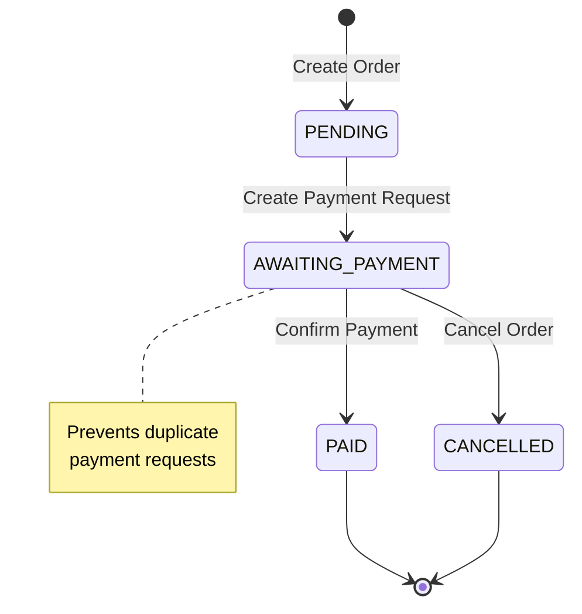
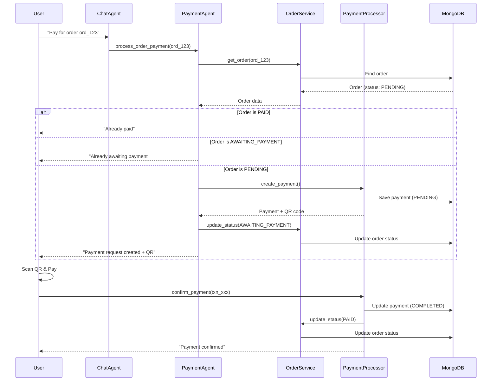

# Order Status Flow with Payment

## 📊 Order Status Transitions



## 🔄 Payment Flow with Order Status

### **Step 1: Create Order**
```
Status: PENDING
User can: Create payment request
```

### **Step 2: Create Payment Request**
```
Status: PENDING → AWAITING_PAYMENT
User can: Complete payment (scan QR)
User cannot: Create another payment request
```

### **Step 3: Confirm Payment**
```
Status: AWAITING_PAYMENT → PAID
Order completed
```

## 🛡️ Duplicate Payment Prevention

### **Before (Problem)**
```
User: "Pay for order ord_123"
System: Creates payment request

User: "Pay for order ord_123" (again)
System: Creates ANOTHER payment request ❌
```

### **After (Solution)**
```
User: "Pay for order ord_123"
System: Creates payment request
        Updates order → AWAITING_PAYMENT

User: "Pay for order ord_123" (again)
System: "⏳ Order is already awaiting payment" ✅
```

## 💻 Implementation

### **PaymentAgent Changes**

```python
async def _process_order_payment(self, order_id: str) -> str:
    # Get order
    order = await OrderService.get_order(order_id)
    
    # Check if already paid
    if order.status == OrderStatus.PAID:
        return "Order already paid"
    
    # Check if already awaiting payment ✨ NEW
    if order.status == OrderStatus.AWAITING_PAYMENT:
        return "Order is already awaiting payment. Please complete the pending payment."
    
    # Create payment request
    result = await self.payment_processor.process_payment(payment_request)
    
    # Update order status ✨ NEW
    await OrderService.update_order_status(
        order_id=order_id,
        status=OrderStatus.AWAITING_PAYMENT,
    )
    
    return "Payment request created..."
```

## 🧪 Testing Scenarios

### **Scenario 1: Normal Flow**

```bash
# 1. Create order
POST /orders/create
Response: { "order_id": "ord_123", "status": "PENDING" }

# 2. Create payment
User: "Pay for order ord_123"
Response: "Payment request created. Status: AWAITING_PAYMENT"

# 3. Confirm payment
POST /payment/confirm/txn_xxx
Response: { "status": "completed" }

# 4. Check order
GET /orders/ord_123
Response: { "status": "PAID" }
```

### **Scenario 2: Duplicate Payment Prevention**

```bash
# 1. Create order
POST /orders/create
Response: { "order_id": "ord_123", "status": "PENDING" }

# 2. Create payment (first time)
User: "Pay for order ord_123"
Response: "Payment request created. Status: AWAITING_PAYMENT"

# 3. Try to create payment again
User: "Pay for order ord_123"
Response: "⏳ Order is already awaiting payment. Please complete the pending payment."
```

### **Scenario 3: Already Paid**

```bash
# Order already paid
User: "Pay for order ord_123"
Response: "ℹ️ Order ord_123 has already been paid."
```

## 📋 Order Status Meanings

| Status | Description | Can Create Payment? | Can Confirm Payment? |
|--------|-------------|---------------------|----------------------|
| `PENDING` | Order created, not paid | ✅ Yes | ❌ No |
| `AWAITING_PAYMENT` | Payment request created | ❌ No | ✅ Yes |
| `PAID` | Payment confirmed | ❌ No | ❌ No |
| `CANCELLED` | Order cancelled | ❌ No | ❌ No |

## 🔍 Database Schema

### **orders Collection**

```javascript
{
  order_id: "ord_xxx",
  status: "AWAITING_PAYMENT",  // Updated after payment request
  total: 100.0,
  items: [...],
  created_at: Date,
  updated_at: Date,
  payment_id: null  // Set after payment confirmation
}
```

### **payments Collection**

```javascript
{
  transaction_id: "txn_xxx",
  order_id: "ord_xxx",  // Linked to order
  amount: 100.0,
  status: "pending",  // Will be "completed" after confirmation
  created_at: Date
}
```

## 🎯 Complete Payment Workflow



## 💡 Benefits

1. **Prevents Duplicate Payments** ✅
   - User can't create multiple payment requests for same order

2. **Clear Order Status** ✅
   - Easy to track order state
   - Know which orders are awaiting payment

3. **Better UX** ✅
   - Clear feedback to user
   - Prevents confusion

4. **Data Integrity** ✅
   - One payment request per order
   - Consistent state management

## 🚨 Edge Cases Handled

### **1. User tries to pay again**
```
Status: AWAITING_PAYMENT
Response: "Order is already awaiting payment"
```

### **2. User tries to pay already paid order**
```
Status: PAID
Response: "Order has already been paid"
```

### **3. Payment expires (future enhancement)**
```python
# Add expiration check
if payment.expires_at < now():
    # Reset order to PENDING
    await OrderService.update_order_status(order_id, OrderStatus.PENDING)
    # Allow new payment request
```

## 📝 Response Messages

### **Payment Request Created**
```
✅ Yêu cầu thanh toán đã được tạo!

Thông tin đơn hàng:
- Mã đơn hàng: ord_123
- Trạng thái: CHỜ THANH TOÁN ⏳

Thông tin thanh toán:
- Mã giao dịch: txn_xxx
- Số tiền: $100.00 USD

📱 Vui lòng quét mã QR để hoàn tất thanh toán.
```

### **Already Awaiting Payment**
```
⏳ Order ord_123 is already awaiting payment.

A payment request has been created for this order.
Please complete the pending payment or contact support if you need assistance.
```

### **Already Paid**
```
ℹ️ Order ord_123 has already been paid.
```
