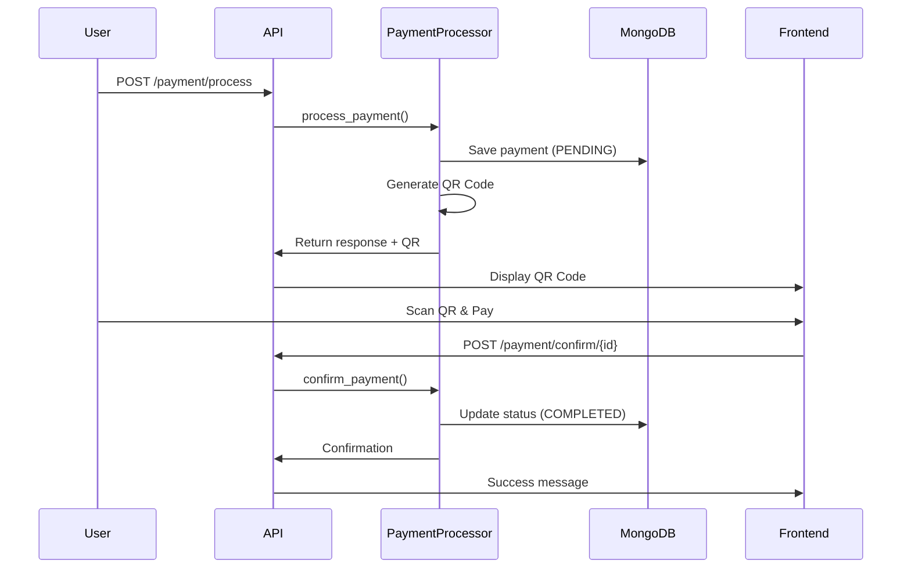

# Real Payment System with MongoDB and QR Code

## 🎯 Overview

Payment system đã được nâng cấp từ mock sang **real implementation** với:
- ✅ **MongoDB** - Lưu trữ payment requests
- ✅ **QR Code** - Tạo mã QR cho thanh toán
- ✅ **Pending Status** - Trạng thái chờ xác nhận
- ✅ **Confirmation Flow** - Xác nhận thanh toán

## 📊 Payment Flow



## 🔧 Changes Made

### **1. Payment Processor** - [`payment_processor.py`](file:///Users/springhoan/DataWork/springme/projects/agentic-ai/langgraph-test/src/tools/payment_processor.py)

**Removed**:
- ❌ Mock mode
- ❌ `_mock_process_payment()`
- ❌ Fake transaction processing

**Added**:
- ✅ MongoDB integration
- ✅ `_generate_qr_code()` - QR code generation
- ✅ `confirm_payment()` - Payment confirmation
- ✅ Async methods (`async def`)

**Key Features**:
```python
# Save payment to MongoDB with PENDING status
payment_doc = {
    "transaction_id": transaction_id,
    "amount": payment_request.amount,
    "currency": payment_request.currency,
    "status": PaymentStatus.PENDING.value,  # ← PENDING
    "created_at": datetime.utcnow(),
}
await db.payments.insert_one(payment_doc)

# Generate QR code
qr_code = self._generate_qr_code({
    "transaction_id": transaction_id,
    "amount": payment_request.amount,
    "currency": payment_request.currency,
})

# Return with QR code in metadata
return PaymentResponse(
    transaction_id=transaction_id,
    status=PaymentStatus.PENDING,
    metadata={
        "qr_code": qr_code,  # ← Base64 QR image
        "payment_url": f"/payment/confirm/{transaction_id}",
    }
)
```

### **2. Payment API** - [`payment.py`](file:///Users/springhoan/DataWork/springme/projects/agentic-ai/langgraph-test/src/api/routes/payment.py)

**Added Endpoints**:

1. **POST /payment/process** - Create payment request
2. **POST /payment/confirm/{transaction_id}** - Confirm payment ✨ NEW
3. **GET /payment/{transaction_id}** - Get payment status

**Updated to async**:
```python
@router.post("/process")
async def process_payment(request: PaymentRequest):
    processor = PaymentProcessor()
    response = await processor.process_payment(request)  # ← async
    return response

@router.post("/confirm/{transaction_id}")
async def confirm_payment(transaction_id: str):
    processor = PaymentProcessor()
    result = await processor.confirm_payment(transaction_id)  # ← NEW
    return result
```

### **3. Payment Agent** - [`payment.py`](file:///Users/springhoan/DataWork/springme/projects/agentic-ai/langgraph-test/src/agents/payment.py)

**Updated**:
```python
# Use await for async process_payment
result = await self.payment_processor.process_payment(payment_request)
```

### **4. Dependencies** - [`requirements.txt`](file:///Users/springhoan/DataWork/springme/projects/agentic-ai/langgraph-test/requirements.txt)

**Added**:
```
# Database
motor>=3.3.0
pymongo>=4.6.0

# QR Code Generation
qrcode[pil]>=7.4.2
pillow>=10.0.0
```

---

## 🧪 Testing

### **1. Install Dependencies**

```bash
pip install motor pymongo qrcode pillow
```

### **2. Start MongoDB**

```bash
# Using Docker
docker run -d -p 27017:27017 --name mongodb mongo:latest

# Or use local MongoDB
mongod
```

### **3. Test Payment Creation**

```bash
# Create payment request
curl -X POST "http://localhost:8000/payment/process" \
  -H "Content-Type: application/json" \
  -d '{
    "amount": 100.0,
    "currency": "USD",
    "description": "Test payment"
  }'
```

**Expected Response**:
```json
{
  "transaction_id": "txn_xxx",
  "status": "pending",
  "amount": 100.0,
  "currency": "USD",
  "message": "Payment request created successfully.\nAmount: 100.0 USD\nTransaction ID: txn_xxx\nStatus: Pending confirmation\nPlease scan the QR code to complete payment.",
  "metadata": {
    "qr_code": "data:image/png;base64,iVBORw0KGgoAAAANS...",
    "payment_url": "/payment/confirm/txn_xxx"
  }
}
```

### **4. View Payment in MongoDB**

```bash
# Connect to MongoDB
mongosh

# Switch to database
use langgraph_ecommerce

# Find payment
db.payments.findOne({"transaction_id": "txn_xxx"})
```

**Expected Document**:
```json
{
  "_id": ObjectId("..."),
  "transaction_id": "txn_xxx",
  "amount": 100.0,
  "currency": "USD",
  "description": "Test payment",
  "status": "pending",
  "metadata": {},
  "created_at": ISODate("2026-01-23T09:14:00.000Z"),
  "updated_at": ISODate("2026-01-23T09:14:00.000Z")
}
```

### **5. Confirm Payment**

```bash
curl -X POST "http://localhost:8000/payment/confirm/txn_xxx"
```

**Expected Response**:
```json
{
  "transaction_id": "txn_xxx",
  "status": "completed",
  "message": "Payment confirmed successfully",
  "confirmed_at": "2026-01-23T09:15:00.000000"
}
```

### **6. Check Status**

```bash
curl "http://localhost:8000/payment/txn_xxx"
```

**Expected Response**:
```json
{
  "transaction_id": "txn_xxx",
  "amount": 100.0,
  "currency": "USD",
  "description": "Test payment",
  "status": "completed",
  "metadata": {},
  "created_at": "2026-01-23T09:14:00.000000",
  "updated_at": "2026-01-23T09:15:00.000000",
  "confirmed_at": "2026-01-23T09:15:00.000000"
}
```

---

## 🎨 Frontend Integration

### **Display QR Code**

```javascript
// After creating payment
const response = await fetch('/payment/process', {
  method: 'POST',
  headers: { 'Content-Type': 'application/json' },
  body: JSON.stringify({
    amount: 100.0,
    currency: 'USD',
    description: 'Order payment'
  })
});

const data = await response.json();

// Display QR code
const qrImage = document.createElement('img');
qrImage.src = data.metadata.qr_code;  // Base64 image
document.getElementById('qr-container').appendChild(qrImage);

// Show transaction ID
document.getElementById('transaction-id').textContent = data.transaction_id;
```

### **Confirm Payment Button**

```javascript
async function confirmPayment(transactionId) {
  const response = await fetch(`/payment/confirm/${transactionId}`, {
    method: 'POST'
  });
  
  const result = await response.json();
  
  if (result.status === 'completed') {
    alert('Payment confirmed successfully!');
    // Redirect or update UI
  }
}
```

---

## 📊 Database Schema

### **payments Collection**

```javascript
{
  transaction_id: String,      // Unique transaction ID
  amount: Number,              // Payment amount
  currency: String,            // Currency code (USD, EUR, etc.)
  description: String,         // Payment description
  status: String,              // pending, completed, failed
  metadata: Object,            // Additional data
  created_at: Date,            // Creation timestamp
  updated_at: Date,            // Last update timestamp
  confirmed_at: Date           // Confirmation timestamp (optional)
}
```

### **Indexes** (Recommended)

```javascript
// Create indexes for better performance
db.payments.createIndex({ "transaction_id": 1 }, { unique: true });
db.payments.createIndex({ "status": 1 });
db.payments.createIndex({ "created_at": -1 });
```

---

## 🔒 Security Considerations

### **1. Payment Verification**

```python
# Add payment verification before confirming
async def confirm_payment(self, transaction_id: str, verification_code: str):
    # Verify code matches
    payment = await db.payments.find_one({"transaction_id": transaction_id})
    if payment.get("verification_code") != verification_code:
        raise PaymentError("Invalid verification code")
    # ... confirm payment
```

### **2. Expiration**

```python
# Add expiration time
payment_doc = {
    "transaction_id": transaction_id,
    "expires_at": datetime.utcnow() + timedelta(minutes=15),  # 15 min expiry
    # ...
}

# Check expiration before confirming
if payment["expires_at"] < datetime.utcnow():
    raise PaymentError("Payment request expired")
```

### **3. Amount Limits**

```python
# Add amount validation
if payment_request.amount > 10000:
    raise PaymentError("Amount exceeds maximum limit")
```

---

## 🚀 Next Steps

1. **Frontend Integration**:
   - Display QR code in UI
   - Add confirm button
   - Show payment status

2. **Payment Gateway**:
   - Integrate real payment gateway (Stripe, PayPal)
   - Add webhook for automatic confirmation
   - Handle payment callbacks

3. **Notifications**:
   - Email confirmation
   - SMS notifications
   - Push notifications

4. **Analytics**:
   - Track payment success rate
   - Monitor pending payments
   - Generate reports

---

## 💡 Usage Example

```python
# Complete flow
from src.tools.payment_processor import PaymentProcessor
from src.models.schemas import PaymentRequest

async def process_user_payment():
    # 1. Create payment
    processor = PaymentProcessor()
    request = PaymentRequest(
        amount=150.0,
        currency="USD",
        description="Order #12345"
    )
    
    response = await processor.process_payment(request)
    print(f"Transaction ID: {response.transaction_id}")
    print(f"QR Code: {response.metadata['qr_code']}")
    
    # 2. User scans QR and pays
    # ... (external payment process)
    
    # 3. Confirm payment
    confirmation = await processor.confirm_payment(response.transaction_id)
    print(f"Status: {confirmation['status']}")  # completed
```

---

## 🐛 Troubleshooting

### **MongoDB Connection Error**

```bash
# Check MongoDB is running
mongosh --eval "db.adminCommand('ping')"

# Check connection string in .env
MONGODB_URL=mongodb://localhost:27017
```

### **QR Code Not Generating**

```bash
# Install dependencies
pip install qrcode[pil] pillow
```

### **Payment Not Saving**

```bash
# Check MongoDB logs
docker logs mongodb

# Verify database name
MONGODB_DB_NAME=langgraph_ecommerce
```
