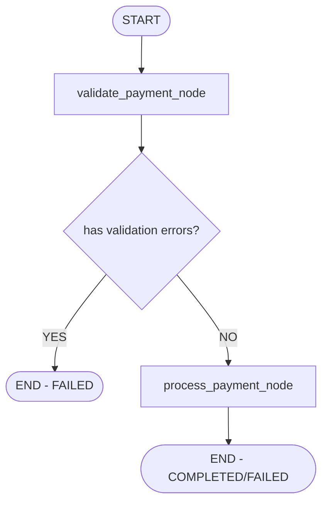

# Testing Payment Workflow

## 🎯 Overview

Payment workflow là một **standalone workflow** riêng biệt để xử lý payment processing với validation.

## 📊 Workflow Structure



## 🧪 Test Methods

### **Method 1: Direct Workflow Test** (Recommended)

Test workflow trực tiếp với Python script:

```bash
# Run test script
python scripts/test_payment_workflow.py
```

**Test Cases**:
1. ✅ Valid payment
2. ❌ Invalid amount (negative)
3. ❌ Invalid amount (zero)
4. ✅ Large amount
5. ✅ Different currencies

---

### **Method 2: Via API Endpoint**

Test qua API `/payment/process`:

```bash
# Valid payment
curl -X POST "http://localhost:8000/payment/process" \
  -H "Content-Type: application/json" \
  -d '{
    "amount": 100.0,
    "currency": "USD",
    "description": "Test payment"
  }'

# Expected response:
# {
#   "transaction_id": "txn_xxx",
#   "status": "completed",
#   "amount": 100.0,
#   "currency": "USD",
#   "message": "Payment of 100.0 USD processed successfully...",
#   "timestamp": "2026-01-16T17:22:00"
# }
```

---

### **Method 3: Via Chat with Metadata**

Test qua chat endpoint với payment_data trong metadata:

```bash
curl -X POST "http://localhost:8000/chat/" \
  -H "Content-Type: application/json" \
  -d '{
    "message": "Process my payment",
    "metadata": {
      "payment_data": {
        "amount": 150.0,
        "currency": "EUR",
        "description": "Order #12345"
      }
    }
  }'
```

---

## 📝 Test Scenarios

### **Scenario 1: Successful Payment**

**Input**:
```python
{
    "amount": 100.0,
    "currency": "USD",
    "description": "Test payment"
}
```

**Expected Flow**:
1. `validate` node → No errors
2. `should_process_payment()` → return `"process"`
3. `process` node → Process payment
4. Result: `status = "completed"`, `transaction_id = "txn_xxx"`

**Test**:
```bash
curl -X POST "http://localhost:8000/payment/process" \
  -H "Content-Type: application/json" \
  -d '{"amount": 100.0, "currency": "USD", "description": "Test"}'
```

---

### **Scenario 2: Invalid Amount (Negative)**

**Input**:
```python
{
    "amount": -50.0,
    "currency": "USD"
}
```

**Expected Flow**:
1. `validate` node → Errors: `["Amount must be greater than 0"]`
2. `should_process_payment()` → return `"end"`
3. Skip `process` node
4. Result: `status = "failed"`, `validation_errors = [...]`

**Test**:
```bash
curl -X POST "http://localhost:8000/payment/process" \
  -H "Content-Type: application/json" \
  -d '{"amount": -50.0, "currency": "USD"}'
```

---

### **Scenario 3: Invalid Amount (Zero)**

**Input**:
```python
{
    "amount": 0.0,
    "currency": "USD"
}
```

**Expected Flow**:
1. `validate` node → Errors
2. Skip processing
3. Result: `status = "failed"`

**Test**:
```bash
curl -X POST "http://localhost:8000/payment/process" \
  -H "Content-Type: application/json" \
  -d '{"amount": 0.0, "currency": "USD"}'
```

---

### **Scenario 4: Missing Currency (Default to USD)**

**Input**:
```python
{
    "amount": 100.0
}
```

**Expected Flow**:
1. Currency defaults to `"USD"`
2. Process normally
3. Result: `currency = "USD"`

**Test**:
```bash
curl -X POST "http://localhost:8000/payment/process" \
  -H "Content-Type: application/json" \
  -d '{"amount": 100.0}'
```

---

### **Scenario 5: Large Amount**

**Input**:
```python
{
    "amount": 999999.99,
    "currency": "EUR"
}
```

**Expected Flow**:
1. Validate → Pass
2. Process → Success
3. Result: Large amount processed

**Test**:
```bash
curl -X POST "http://localhost:8000/payment/process" \
  -H "Content-Type: application/json" \
  -d '{"amount": 999999.99, "currency": "EUR"}'
```

---

### **Scenario 6: Different Currencies**

**Test multiple currencies**:
```bash
# USD
curl -X POST "http://localhost:8000/payment/process" \
  -d '{"amount": 100, "currency": "USD"}'

# EUR
curl -X POST "http://localhost:8000/payment/process" \
  -d '{"amount": 100, "currency": "EUR"}'

# VND
curl -X POST "http://localhost:8000/payment/process" \
  -d '{"amount": 2000000, "currency": "VND"}'
```

---

## 🔍 Monitoring Workflow Execution

### **Watch Logs**

```bash
# Terminal 1: Run server
make run

# Terminal 2: Watch payment logs
tail -f data/logs/chatbot.log | grep -E "payment|Payment|PAYMENT"
```

**Expected log flow**:
```
INFO - Validating payment...
INFO - Processing payment: txn_xxx
INFO - Processing payment: amount=100.0, currency=USD
INFO - Mock payment successful: txn_xxx
INFO - Payment processed: txn_xxx
```

---

## 🧪 Python Test Script

### **Run Direct Test**

```bash
# Make executable
chmod +x scripts/test_payment_workflow.py

# Run tests
python scripts/test_payment_workflow.py
```

### **Expected Output**

```
==========================================================
Testing Payment Workflow
==========================================================

Test 1: Valid Payment
------------------------------------------------------------
✅ Transaction ID: txn_xxx
✅ Status: completed
✅ Amount: 100.0 USD
✅ Errors: []

Test 2: Invalid Amount (Negative)
------------------------------------------------------------
Status: failed
Errors: ['Amount must be greater than 0']
✅ Correctly rejected invalid amount

Test 3: Invalid Amount (Zero)
------------------------------------------------------------
Status: failed
Errors: ['Amount must be greater than 0']
✅ Correctly rejected zero amount

Test 4: Large Amount
------------------------------------------------------------
✅ Transaction ID: txn_xxx
✅ Status: completed
✅ Amount: 999999.99 EUR

Test 5: Different Currencies
------------------------------------------------------------
✅ USD: completed
✅ EUR: completed
✅ GBP: completed
✅ JPY: completed
✅ VND: completed

==========================================================
Testing Complete
==========================================================
```

---

## 🎯 Integration Test

### **Test via Chat Workflow**

Payment workflow cũng được gọi từ chat workflow khi intent = payment:

```bash
# 1. Send payment message
curl -X POST "http://localhost:8000/chat/" \
  -H "Content-Type: application/json" \
  -d '{
    "message": "I want to pay 100 USD",
    "metadata": {
      "payment_data": {
        "amount": 100.0,
        "currency": "USD",
        "description": "Via chat"
      }
    }
  }'

# 2. Check logs
tail -f data/logs/chatbot.log
```

**Expected**:
1. Intent classified as `payment`
2. Route to `payment_node`
3. PaymentAgent calls payment workflow internally
4. Return success message

---

## 🔧 Mock vs Real Payment

### **Current: Mock Mode** (Default)

```bash
# In .env
PAYMENT_MOCK_MODE=true
```

**Behavior**:
- Always succeeds
- Generates fake transaction ID
- No real payment processing

### **Real Mode** (Not Implemented)

```bash
# In .env
PAYMENT_MOCK_MODE=false
```

**Behavior**:
- Would integrate with real payment gateway (Stripe, PayPal, etc.)
- Currently raises: `"Real payment processing not implemented"`

---

## 📊 Validation Rules

### **Amount Validation**

```python
# src/utils/validators.py

def validate_amount(amount: float) -> List[str]:
    errors = []
    if amount <= 0:
        errors.append("Amount must be greater than 0")
    if amount > 1000000:
        errors.append("Amount exceeds maximum limit")
    return errors
```

### **Currency Validation**

```python
def validate_currency(currency: str) -> List[str]:
    valid_currencies = ["USD", "EUR", "GBP", "JPY", "VND"]
    if currency not in valid_currencies:
        return [f"Invalid currency: {currency}"]
    return []
```

---

## 🐛 Debugging

### **Check State at Each Node**

Add logging in workflow nodes:

```python
# src/graphs/payment_workflow.py

async def validate_payment_node(state: PaymentState):
    logger.info(f"Validate input state: {state}")
    # ... validation logic
    result = {...}
    logger.info(f"Validate output: {result}")
    return result
```

### **Inspect Final State**

```python
import asyncio
from src.graphs.payment_workflow import get_payment_workflow

async def debug():
    workflow = get_payment_workflow()
    initial_state = {"amount": 100.0, "currency": "USD"}
    result = await workflow.ainvoke(initial_state)
    
    print("Final state:")
    for key, value in result.items():
        print(f"  {key}: {value}")

asyncio.run(debug())
```

---

## 💡 Quick Commands

```bash
# 1. Run Python test script
python scripts/test_payment_workflow.py

# 2. Test via API
curl -X POST "http://localhost:8000/payment/process" \
  -H "Content-Type: application/json" \
  -d '{"amount": 100.0, "currency": "USD"}'

# 3. Test via chat
curl -X POST "http://localhost:8000/chat/" \
  -H "Content-Type: application/json" \
  -d '{
    "message": "Process payment",
    "metadata": {"payment_data": {"amount": 100, "currency": "USD"}}
  }'

# 4. Watch logs
tail -f data/logs/chatbot.log | grep -i payment
```

---

## ✅ Expected Results

| Test Case | Status | Validation Errors | Transaction ID |
|-----------|--------|-------------------|----------------|
| Valid payment | `completed` | `[]` | `txn_xxx` |
| Negative amount | `failed` | `["Amount must be > 0"]` | - |
| Zero amount | `failed` | `["Amount must be > 0"]` | - |
| Large amount | `completed` | `[]` | `txn_xxx` |
| Different currencies | `completed` | `[]` | `txn_xxx` |

---

## 🎓 Key Takeaways

1. **Payment workflow is standalone** - Có thể test riêng biệt
2. **Two-step process** - Validate → Process
3. **Conditional routing** - Skip processing if validation fails
4. **Mock mode** - Safe testing without real payments
5. **Multiple test methods** - Direct, API, Chat integration
