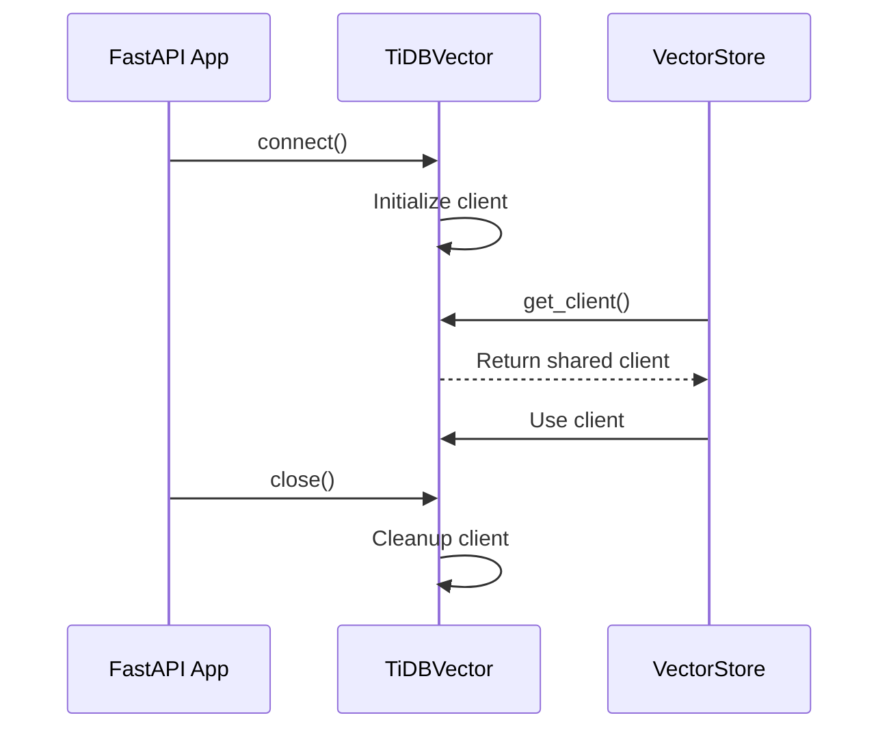

# TiDB Vector Connection Refactoring

## 🎯 Changes Made

Refactored TiDB Vector connection to follow the same pattern as MongoDB, with shared client management in the `database` module.

## 📁 File Structure

```
src/
├── database/
│   ├── mongodb.py          # MongoDB connection (existing)
│   └── tidb.py             # TiDB Vector connection (NEW)
└── services/
    └── vector_store.py     # Uses shared TiDB client
```

## 🔄 Before vs After

### **Before** ❌

```python
# Each TiDBVectorStore instance created its own connection
class TiDBVectorStore:
    def __init__(self):
        self.client = TiDBVectorClient(
            connection_string=...,
            table_name=...,
        )
```

**Problems:**
- Multiple connections created
- No connection pooling
- Hard to manage lifecycle
- Inconsistent with MongoDB pattern

### **After** ✅

```python
# Shared TiDB client managed by TiDBVector class
class TiDBVector:
    client: Optional[TiDBVectorClient] = None
    
    @classmethod
    def connect(cls):
        cls.client = TiDBVectorClient(...)
    
    @classmethod
    def get_client(cls):
        return cls.client

# Services use shared client
class TiDBVectorStore:
    def __init__(self):
        self.client = TiDBVector.get_client()
```

**Benefits:**
- ✅ Single shared connection
- ✅ Centralized management
- ✅ Consistent with MongoDB
- ✅ Lifecycle managed in app startup

---

## 🚀 Usage

### **Application Startup**

```python
# src/api/main.py
@asynccontextmanager
async def lifespan(app: FastAPI):
    # Connect to databases
    await MongoDB.connect()
    TiDBVector.connect()  # ← NEW
    
    yield
    
    # Close connections
    await MongoDB.close()
    TiDBVector.close()  # ← NEW
```

### **In Services**

```python
# src/services/vector_store.py
from src.database.tidb import TiDBVector

class TiDBVectorStore:
    def __init__(self):
        # Get shared client
        self.client = TiDBVector.get_client()
```

### **Direct Access**

```python
# Anywhere in the app
from src.database.tidb import get_tidb_client

client = get_tidb_client()
client.insert(...)
client.search(...)
```

---

## 📊 Connection Lifecycle



---

## 🔧 API Reference

### **TiDBVector Class**

```python
class TiDBVector:
    """TiDB Vector connection manager."""
    
    @classmethod
    def connect(
        cls,
        connection_string: Optional[str] = None,
        table_name: Optional[str] = None,
        embedding_dimension: Optional[int] = None,
        distance_strategy: Optional[str] = None,
    ) -> None:
        """Connect to TiDB Vector database."""
    
    @classmethod
    def close(cls) -> None:
        """Close TiDB Vector connection."""
    
    @classmethod
    def get_client(cls) -> TiDBVectorClient:
        """Get TiDB Vector client instance."""
    
    @classmethod
    def is_connected(cls) -> bool:
        """Check if TiDB Vector is connected."""
```

### **Helper Function**

```python
def get_tidb_client() -> TiDBVectorClient:
    """Get TiDB Vector client instance."""
    return TiDBVector.get_client()
```

---

## 🧪 Testing

### **Test Connection**

```python
from src.database.tidb import TiDBVector

# Connect
TiDBVector.connect()

# Check status
assert TiDBVector.is_connected()

# Get client
client = TiDBVector.get_client()
assert client is not None

# Close
TiDBVector.close()
assert not TiDBVector.is_connected()
```

### **Test Vector Store**

```python
from src.services.vector_store import TiDBVectorStore
from langchain_core.documents import Document

# Initialize (uses shared client)
store = TiDBVectorStore()

# Add documents
docs = [Document(page_content="test")]
ids = await store.add_documents(docs)

# Search
results = await store.similarity_search("test")
assert len(results) > 0
```

---

## 🎯 Benefits

### **1. Consistency**

Same pattern as MongoDB:
```python
# MongoDB
await MongoDB.connect()
db = MongoDB.get_database()

# TiDB Vector
TiDBVector.connect()
client = TiDBVector.get_client()
```

### **2. Resource Efficiency**

- Single connection shared across all services
- No duplicate connections
- Better resource utilization

### **3. Centralized Management**

- Connection config in one place
- Easy to monitor and debug
- Lifecycle managed by app

### **4. Error Handling**

```python
try:
    client = TiDBVector.get_client()
except RuntimeError:
    # Client not initialized
    TiDBVector.connect()
    client = TiDBVector.get_client()
```

---

## 🔄 Migration Guide

### **Old Code**

```python
# Old way - each instance creates connection
vector_store = TiDBVectorStore(
    connection_string="...",
    table_name="documents"
)
```

### **New Code**

```python
# New way - uses shared client
vector_store = TiDBVectorStore()

# Or with custom embedding provider
vector_store = TiDBVectorStore(embedding_provider="openai")
```

### **No Breaking Changes**

The public API remains the same:
```python
# All these still work
await vector_store.add_documents(docs)
await vector_store.similarity_search(query)
await vector_store.delete_documents(ids)
```

---

## 📝 Configuration

### **Environment Variables**

```bash
# .env
TIDB_CONNECTION_STRING=mysql+pymysql://...
TIDB_TABLE_NAME=documents
TIDB_EMBEDDING_DIMENSION=768
TIDB_DISTANCE_STRATEGY=cosine
```

### **Programmatic Override**

```python
# Override defaults
TiDBVector.connect(
    table_name="custom_table",
    embedding_dimension=1536,
    distance_strategy="l2"
)
```

---

## 🐛 Troubleshooting

### **Client Not Initialized**

```python
RuntimeError: TiDB Vector client not initialized. Call connect() first.
```

**Solution:**
```python
# Make sure connect() is called in app startup
TiDBVector.connect()
```

### **Connection Already Exists**

```python
# Safe to call multiple times
TiDBVector.connect()  # Creates connection
TiDBVector.connect()  # Reuses existing
```

---

## 💡 Best Practices

1. **Initialize Once**
   - Call `connect()` in app startup
   - Use `get_client()` everywhere else

2. **Check Connection**
   ```python
   if not TiDBVector.is_connected():
       TiDBVector.connect()
   ```

3. **Error Handling**
   ```python
   try:
       client = TiDBVector.get_client()
   except RuntimeError:
       logger.error("TiDB not connected")
       # Handle gracefully
   ```

4. **Cleanup**
   - Always call `close()` in shutdown
   - Handled automatically by lifespan

---

## 🎉 Summary

**Refactored TiDB Vector connection to:**
- ✅ Use shared client pattern
- ✅ Match MongoDB structure
- ✅ Centralize connection management
- ✅ Improve resource efficiency
- ✅ Maintain backward compatibility
