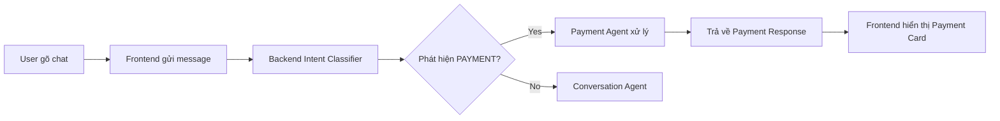

# Hướng Dẫn Thanh Toán Qua Chatbox

## 🎯 Tổng Quan

Frontend đã được tích hợp sẵn khả năng xử lý thanh toán thông qua chat tự nhiên. Backend sẽ tự động phát hiện intent thanh toán và xử lý.

## 💬 Cách Sử Dụng

### Bước 1: Khởi động Backend và Frontend

**Terminal 1 - Backend:**
```bash
cd /springme/projects/agentic-ai/langgraph-test
source venv/bin/activate
# Chạy backend server (ví dụ: uvicorn src.api.main:app --reload)
```

**Terminal 2 - Frontend:**
```bash
cd frontend
npm run dev
```

Mở trình duyệt tại: `http://localhost:3000`

### Bước 2: Gửi Lệnh Thanh Toán

Trong chatbox, bạn có thể gõ các câu tự nhiên như:

#### ✅ Các Mẫu Câu Thanh Toán:

1. **Thanh toán đơn giản:**
   ```
   I want to pay $50
   ```

2. **Thanh toán với số tiền cụ thể:**
   ```
   I want to pay 100 USD
   ```

3. **Thanh toán với mô tả:**
   ```
   I need to pay $25.99 for my subscription
   ```

4. **Thanh toán bằng tiếng Việt (nếu backend hỗ trợ):**
   ```
   Tôi muốn thanh toán 500000 VND
   ```

5. **Các biến thể khác:**
   ```
   Process payment of $75
   Charge me $30
   Pay 100 dollars
   ```

### Bước 3: Xem Kết Quả

Sau khi gửi, bạn sẽ thấy:

1. **Message của bạn** hiển thị bên phải (màu tím gradient)
2. **Response từ AI** hiển thị bên trái với:
   - 🟢 **Intent Badge**: Hiển thị "PAYMENT" màu xanh lá
   - 💳 **Payment Card**: Hiển thị chi tiết giao dịch:
     - Transaction ID
     - Amount (số tiền)
     - Currency (đơn vị tiền tệ)
     - Status (trạng thái: COMPLETED, PENDING, FAILED)

## 🔧 Luồng Xử Lý



## 📊 Cấu Trúc Dữ Liệu

### Request từ Frontend:
```typescript
{
  message: "I want to pay $50",
  session_id: "abc123...",  // Tự động tạo
  metadata: {}
}
```

### Response từ Backend:
```typescript
{
  message: "Payment processed successfully...",
  session_id: "abc123...",
  intent: "PAYMENT",
  metadata: {
    intent_confidence: 0.95,
    transaction_id: "txn_...",
    amount: 50.0,
    currency: "USD",
    status: "COMPLETED"
  }
}
```

## 🎨 Giao Diện Payment Card

Payment Card sẽ hiển thị trong message với:

```
┌─────────────────────────────┐
│ 💳 Payment Details          │
├─────────────────────────────┤
│ Amount:        USD 50.00    │
│ Transaction ID: txn_xyz123  │
│ Status:        ✅ COMPLETED │
└─────────────────────────────┘
```

## 🧪 Test Scenarios

### Test 1: Thanh toán thành công
```
Input: "I want to pay $50"
Expected: 
- Intent badge: PAYMENT (green)
- Payment card with status COMPLETED
```

### Test 2: Thanh toán với số tiền lớn
```
Input: "Process payment of $1000"
Expected:
- Payment card showing $1000.00
```

### Test 3: Thanh toán với mô tả
```
Input: "I need to pay $25.99 for subscription"
Expected:
- Payment processed with description
```

## 🔍 Debug và Troubleshooting

### Kiểm tra Backend đang chạy:
```bash
curl http://localhost:8000/health
```

### Kiểm tra Frontend đang chạy:
Mở `http://localhost:3000` trong browser

### Xem Console Logs:
- **Browser DevTools** (F12): Xem network requests và errors
- **Backend Terminal**: Xem API logs

### Common Issues:

1. **Payment card không hiển thị:**
   - Kiểm tra backend có trả về `intent: "PAYMENT"`
   - Kiểm tra metadata có chứa payment data

2. **Message không gửi được:**
   - Kiểm tra backend URL trong `.env`
   - Kiểm tra CORS settings

3. **Session bị mất:**
   - Session ID được lưu trong Zustand store
   - Refresh page sẽ tạo session mới

## 📝 Code Reference

### Frontend Components:
- **ChatContainer**: `/frontend/src/components/ChatContainer.tsx`
- **MessageList**: `/frontend/src/components/MessageList.tsx`
- **PaymentCard**: `/frontend/src/components/PaymentCard.tsx`
- **IntentBadge**: `/frontend/src/components/IntentBadge.tsx`

### API Services:
- **chatService**: `/frontend/src/services/chatService.ts`
- **paymentService**: `/frontend/src/services/paymentService.ts`

### State Management:
- **chatStore**: `/frontend/src/store/chatStore.ts`

## 🚀 Advanced Usage

### Gửi Payment với Metadata (qua API trực tiếp):
```bash
curl -X POST "http://localhost:8000/chat/" \
  -H "Content-Type: application/json" \
  -d '{
    "message": "I want to pay 100 USD",
    "metadata": {
      "payment_data": {
        "amount": 100.0,
        "currency": "USD",
        "description": "Via chat"
      }
    }
  }'
```

### Kiểm tra Transaction Status:
```bash
curl http://localhost:8000/payment/{transaction_id}
```

## 📚 Tài Liệu Liên Quan

- [Frontend README](../frontend/README.md)
- [Backend Architecture](./architecture.md)
- [API Documentation](./api_docs.md)
- [TypeScript Skill Guide](../frontend/docs/aiskill.md)

---

## ✅ Quick Start Checklist

- [ ] Backend đang chạy tại `http://localhost:8000`
- [ ] Frontend đang chạy tại `http://localhost:3000`
- [ ] Mở browser và truy cập frontend
- [ ] Gõ: "I want to pay $50" trong chatbox
- [ ] Nhấn Enter
- [ ] Xem Payment Card hiển thị với transaction details

**Chúc bạn test thành công! 🎉**
